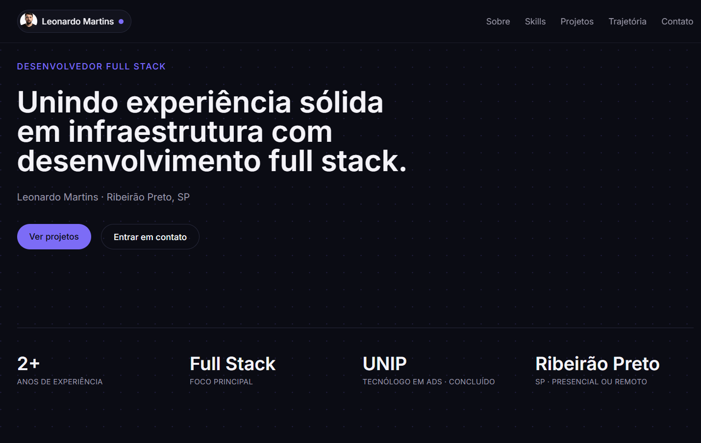

# Portfólio Full Stack

🔗 **Demo ao vivo:** [portfolio-fullstack-delta-seven.vercel.app](https://portfolio-fullstack-delta-seven.vercel.app)

Site de portfólio pessoal com um back-end real por trás: banco de dados, formulário de contato funcional (com notificação por e-mail) e um painel administrativo com login para gerenciar os projetos exibidos — sem precisar mexer em código.



## Stack

| Camada | Tecnologias |
|---|---|
| Front-end | Next.js 14 (App Router) · TypeScript · Tailwind CSS |
| Back-end | API Routes do Next.js · Zod (validação) |
| Banco de dados | PostgreSQL (Neon) via Prisma ORM |
| Autenticação | NextAuth (Auth.js v4) — Credentials Provider + bcrypt |
| E-mail | Resend (API HTTP) |
| Deploy | Vercel, com CI/CD automático a cada push no `master` |

## Funcionalidades

- **Site público** com seções de apresentação, skills, trajetória profissional, projetos e contato.
- **Projetos dinâmicos**: cadastrados via banco de dados, não hardcoded — o admin gerencia tudo pelo painel.
- **Painel administrativo protegido** (`/admin/dashboard`): CRUD completo de projetos e visualização das mensagens recebidas pelo formulário de contato.
- **Formulário de contato resiliente**: toda mensagem é salva no banco mesmo se o envio de e-mail falhar, e o usuário recebe um status honesto sobre o que realmente aconteceu.
- **Autenticação segura**: sessão JWT, senha com hash bcrypt, rotas de mutação protegidas por `getServerSession`.

## Projetos em destaque

| Projeto | Descrição |
|---|---|
| [Sistema de estoque](https://github.com/Leonardocmartins02/Sistema-Estoque-main) | Monorepo de gestão de estoque (SimpleStock) — cadastro de produtos, controle de saldo e movimentações. |
| [Agendamento de salas](https://github.com/Leonardocmartins02/Projeto-Agendamento-de-Salas) | Reserva de salas para uma universidade — backend em Flask/SQLAlchemy. |

## Rodando localmente

### 1. Instalar dependências

```bash
npm install
```

### 2. Configurar variáveis de ambiente

```bash
cp .env.example .env
```

Gere um valor aleatório para `NEXTAUTH_SECRET`:

```bash
openssl rand -base64 32
```

### 3. Banco de dados

```bash
npm run db:push   # cria as tabelas a partir de prisma/schema.prisma
npm run db:seed   # cria o usuario admin e projetos de exemplo
```

> O projeto usa PostgreSQL (recomendado: um banco gratuito no [Neon](https://neon.tech)). Aponte `DATABASE_URL` para ele tanto em desenvolvimento quanto em produção.

### 4. Rodar

```bash
npm run dev
```

- Site público: `http://localhost:3000`
- Login admin: `http://localhost:3000/admin/login`
- Painel admin: `http://localhost:3000/admin/dashboard`

## Notificação por e-mail do formulário de contato

Toda mensagem do formulário de contato é sempre salva no banco (visível em `/admin/dashboard`). Para também receber um e-mail de aviso, configure o [Resend](https://resend.com) no `.env`:

```env
RESEND_API_KEY="re_sua_chave_aqui"
EMAIL_FROM="Portfolio <onboarding@resend.dev>"
EMAIL_TO="seuemail@exemplo.com"
```

> **Por que não SMTP do Outlook/Hotmail?** A Microsoft desativou permanentemente a autenticação básica no SMTP de contas pessoais Outlook.com/Hotmail — qualquer tentativa retorna `535 5.7.139`. Por isso o envio usa a API HTTP do Resend.

## Personalizando o conteúdo

- **Dados pessoais** (nome, bio, links, skills, trajetória): `src/lib/data.ts`.
- **Tema/cores**: `tailwind.config.ts`.
- **Projetos**: não edite código — use o painel admin (`/admin/dashboard`).

## Estrutura do projeto

```
src/
  app/
    page.tsx               -> pagina publica (monta todas as secoes)
    admin/login/            -> pagina de login
    admin/dashboard/        -> painel admin (protegido)
    api/contact/            -> API do formulario de contato
    api/projects/            -> API de CRUD de projetos
    api/auth/[...nextauth]  -> rota do NextAuth
  components/                -> secoes da pagina publica (Hero, About, etc)
  components/admin/          -> componentes do painel admin
  lib/prisma.ts               -> cliente do Prisma (singleton)
  lib/auth.ts                 -> configuracao do NextAuth
  lib/data.ts                 -> conteudo estatico editavel (perfil)
  middleware.ts                -> protege as rotas /admin/dashboard
prisma/
  schema.prisma                -> modelos do banco (Project, ContactMessage, Admin)
  seed.ts                       -> script de dados iniciais
```

## Deploy

Já publicado na Vercel com integração contínua ao GitHub — cada push no `master` gera um novo deploy automaticamente. O banco de produção é PostgreSQL (Neon), configurado via `DATABASE_URL` nas variáveis de ambiente da Vercel.
